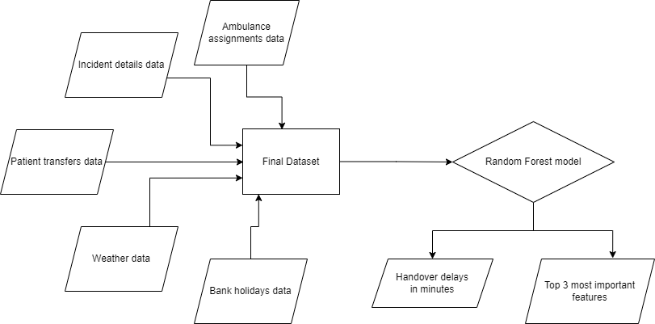

[](LICENSE)

<!-- Add in additional badges as appropriate -->


# NHS AI Lab Skunkworks project: Ambulance Handover Delay Predictor

> A pilot project for the NHS AI (Artificial Intelligence) Lab Skunkworks team, Ambulance Handover Delay Predictor, uses statistical analysis and machine learning to understand whether AI approaches can be used to create a proactive response to the redirect of ambulances between hospitals on a given day in order to minimise the time spent waiting for patient handover and thereby maximise the time available to respond to patient calls for help

Ambulance Handover Delay Predictor was selected as a project in Q2 2022 following a succesful pitch to the AI Skunkworks problem-sourcing programme.

# Table of contents
- NHS AI Lab Skunkworks project: Ambulance Handover Delay Predictor
    - [Intended Use](#intended-use)
    - [Data Protection](#data-protection)
    - [Background](#background)
    - [Model Selection](#model-selection)
    - [Known Limitations](#known-limitations)
    - [Getting Started](#getting-started)
    - [NHS AI Lab Skunkworks](#nhs-ai-lab-skunkworks)
    - [Licence](#licence)

> The full [technical report (PDF)](add-link-here) is available to download.

## Intended Use

This proof of concept ([TRL 4](https://en.wikipedia.org/wiki/Technology_readiness_level)) is intended to demonstrate the technical validity of applying a Random Forest modelling technique to numerous datasets in order to solve the problem of ambulance delays while handing patients over to the emergency departments at hospitals. It is not intended for deployment in a clinical or non-clinical setting without further development and compliance with the [UK Medical Device Regulations 2002](https://www.legislation.gov.uk/uksi/2002/618/contents/made) where the product qualifies as a medical device.


## Data Protection

This project was subject to a Data Protection Impact Assessment (DPIA), ensuring the protection of the data used in line with the [UK Data Protection Act 2018](https://www.legislation.gov.uk/ukpga/2018/12/contents/enacted) and [UK GDPR](https://ico.org.uk/for-organisations/dp-at-the-end-of-the-transition-period/data-protection-and-the-eu-in-detail/the-uk-gdpr/). No data or trained models are shared in this repository.


## Background

South Central Ambulance Service (SCAS) has around 2.5 million total patient contacts per year across the services of Hampshire, Thames Valley, Surrey and Sussex.  To ensure the delivery of an effective and efficient service, SCAS need to make informed decisions, drawing upon the best possible management information available.

The decision on where to take ambulance patients is complex taking in factors such as severity of illness, urgency of the situation, geography, travel time and handover/queuing time.  With national targets on handover times and NHS trusts publishing their ability to meet these targets, there is an opportunity to determine if the large volume of electronic data available from patients who have been taken to hospital can be used within Artificial intelligence (AI)/Machine Learning (ML) to predict where patients should be sent to minimise waiting times.  Such techniques are commonly used across industries that provide services or sell goods through, but not limited to: optimising staffing schedules, reducing waiting times (e.g. to answer calls or to be physically seen) and increasing the robustness of a queuing system to the inevitable variation in demand for a service.  

Looking across an NHS trust, knowing where ambulances can handover patients to inform balancing for care outcomes could potentially improve the performance and safety for both the ambulance trusts and hospitals, whilst also: 
- Reducing the stress and improve the overall experience for the patient
- Reducing the overall clinical risk as handover from the ambulance to the hospital will happen as quickly as possible
- Reducing operational pressures on the ambulance service provider by reducing the amount of reactive management, thereby also reducing staffing stress levels
- Increasing both the hospital and ambulance efficiency – for every patient waiting to be admitted to the hospital, there is an ambulance crew that is not able to attend another call


## Model Selection

The different approaches considered were as follows:
1. Regression techniques
2. Time Series Analysis
3. Naive Bayes technique
4. Decision Tree algorithm
5. Random Forest algorithm

The Linear Regression, Time Series Model and Naive Bayes model were ruled out after the investigations were carried out. A Linear Regression approach was not carried forward due to the weak correlations between the feature variables and the target variable (handover delay). Due to the nature of the project, where both the handover delays (in minutes) and the reasons causing the delays were to be predicted, the Time Series approach was de-scoped. The Naive Bayes approach was also de-scoped, due to the target variable being not normally distributed and this being one of the main assumptions of the Naive Bayes model.

The Decision Tree model was a better fit to the data and the project. It can produce both numerical and categorical (non-numerical) predictions. A Decision Tree is a Machine Learning algorithm that helps make decisions based on previous experiences. At every step, based on the different features, the model answers questions which it ultimately uses to come to a conclusion, which is the prediction. Additionally, the most important features which contributed to the predition being made can be extracted from the model. This was used to obtain the potential reasons for the delay. On the other hand, Decision Trees are prone to overfitting, which is the case when the model performs well during training, but fails to produce reliable predictions in production.

The Random Forest algorithm consists of multiple Decision Trees. We can get predictions for the handover delays, and by extracting the most important features contributing to the predictions, the potential reasons for the delays can be obtained. Since the Random Forest algorithm consists of multiple Decision Trees, it reduces the risks of overfitting as well. 

Overall, out of the five models considered, the Random Forest model gave the best trade-off between accuracy and interpretability, giving us predictions for both the handover delay and the potential reasons for such delay.

## Known Limitations

There were multiple limitations that were faced over the course of this project. Some of them were:
1. No data was available about the state of the hospitals themselves at the times available in the data. This made it hard to identify whether there were some internal factors in the hospitals which were contributing to the ambulance delays. For example, staff sicknesses. 
2. The pre-processing stages of this analysis are designed to work on the format that the `Assignments dataset`, `Incidents dataset`, and `PTS dataset` were available for the project. If different datasets are to be used, or if the structure of the datasets have changed, the code will need modifying so as to ensure the smooth running of the code.
3. The exclusion of non-emergency incidents from the dataset reduced the available data by more than 50%. This can be reviewed so that more data is available for analysis in the future.
4. Disparity in the number of data points for the different hospitals. The number of data points available for the different hospitals varied a lot in the hospitals. A subset of the most significant hospitals was used for the project.


## Data Pipeline

The data that were available for the project were:
1. Ambulance assignments data
2. Incidents data
3. Patient transfers data

which included:

1. Details about incidents which an ambulance had attended, 
2. Details about ambulances that arrive at hospitals to hand over patients to emergency departments, and
3. Details about patient transfers in, out and between hospitals

The additional datasets that were used for the project included:
1. UK Bank holidays data
2. Weather data - Minimum temperature, Maximum temperature, Rainfall (mm)

The data was cleaned and preprocessed in order to prepare the data for analysis and modelling. Some of the metrics derived were the handover time in minutes (and consequently handover delay), the euclidean distance between the hospitals, and the past delays in handing over patients. The correlations and trends in the data were investigated. The outcome of this investigation was considered before deciding on any modelling approaches. 



The data dictionary can be found [in the data dictionary notebook.](notebooks/00-data_dictionary_notebook.ipynb)


## Directory Structure

```
skunkworks-ambulance-queueing-prediction
    ├──.github
    ├──docs
    ├──notebooks
    ├──outputs
    ├──src
        ├──data
        ├──features
        ├──models
        └──visualisations
    ├──tests
    └──requirements.txt

```

## Getting Started
Note that `Python 3.9.12` was used for this project.

1. Create a new virtual environment e.g., `pyenv virtualenv 3.9.12 ambulance-delays-project`
2. Activate your environment e.g., `pyenv activate ambulance-delays-project`
3. Install required packages: `pip install -r requirements.txt`
4. Execute notebooks in [notebooks/](notebooks)

### End to End Testing

There is an end-to-end integration test available, contained in `tests`.

In order to use it, once you have completed step 3 above, you can then use the following instructions:

If using PowerShell:

```
tests/run-all.ps1
```

If using bash:

```
sh tests/run-all.sh
```

## NHS AI Lab Skunkworks
The project is supported by the NHS AI Lab Skunkworks, which exists within the NHS AI Lab in the NHS Transformation Directorate to support the health and care community to rapidly progress ideas from the conceptual stage to a proof of concept.

Find out more about the [NHS AI Lab Skunkworks](https://transform.england.nhs.uk/ai-lab/ai-lab-programmes/skunkworks/).
Join our [Virtual Hub](https://future.nhs.uk/connect.ti/system/text/register) to hear more about future problem-sourcing event opportunities.
Get in touch with the Skunkworks team at [england.aiskunkworks@nhs.net](england.aiskunkworks@nhs.net).


## Licence

Unless stated otherwise, the codebase is released under [the MIT Licence][mit].
This covers both the codebase and any sample code in the documentation.

The documentation is [© Crown copyright][copyright] and available under the terms
of the [Open Government 3.0][ogl] licence.

[mit]: LICENCE
[copyright]: http://www.nationalarchives.gov.uk/information-management/re-using-public-sector-information/uk-government-licensing-framework/crown-copyright/
[ogl]: http://www.nationalarchives.gov.uk/doc/open-government-licence/version/3/


